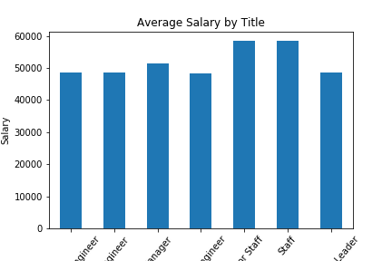

# Data Modeling, Data Engineering, & Data Analysis

## Data Modeling
Inspect the CSVs and sketch out an ERD of the tables. Feel free to use a tool like http://www.quickdatabasediagrams.com.

## Data Engineering
1. Use the information you have to create a table schema for each of the six CSV files, specifying data types, primary keys, foreign keys, and other constraints.
2. Import each CSV file into the corresponding SQL table.

## Data Analysis
1. List the following details of each employee: employee number, last name, first name, gender, and salary.
2. List employees who were hired in 1986.
3. List the manager of each department with the following information: department number, department name, the manager's employee number, last name, first name, and start and end employment dates.
4. List the department of each employee with the following information: employee number, last name, first name, and department name.
5. List all employees whose first name is "Hercules" and last names begin with "B."
6. List all employees in the Sales department, including their employee number, last name, first name, and department name.
7. List all employees in the Sales and Development departments, including their employee number, last name, first name, and department name.
8. In descending order, list the frequency count of employee last names, i.e., how many employees share each last name.
9. Import the SQL database into Pandas. 
  -from sqlalchemy import create_engine
  -engine = create_engine('postgresql://localhost:5432/<your_db_name>')
  -connection = engine.connect()
10. Create a bar chart of average salary by title.

Copyright
Trilogy Education Services © 2019. All Rights Reserved.
